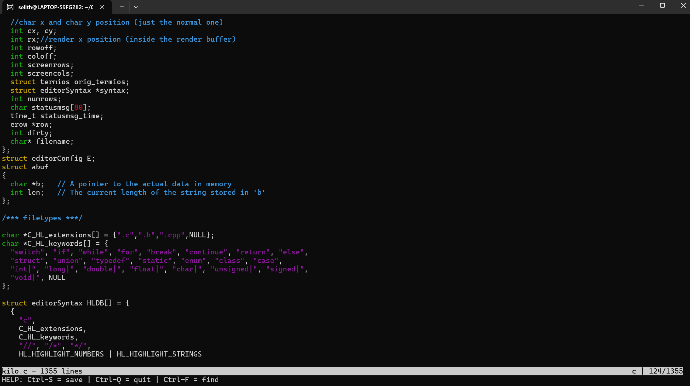

# Kilo: Text Editor From Scratch in C

A lightweight, terminal-based text editor built from the ground up in C. This project was an exercise in understanding low-level systems programming, memory management, and how command-line tools interact directly with the terminal interface without relying on heavy external libraries like `ncurses`.


*(Screenshot of the editor in action with syntax highlighting)*

## 🚀 Features

* **Syntax Highlighting:** Custom color support for C/C++ (comments, keywords, strings).
* **Search Functionality:** Incremental search with `Ctrl+F`.
* **File Operations:** Open, edit, and save files to disk.
* **Raw Mode:** Custom terminal configuration to handle keypresses directly.
* **Navigation:** Full support for Arrow keys, `Page Up/Down`, `Home`, and `End`.
* **Smart Rendering:** Handles scrolling and dynamic window resizing.

---

## 🧠 What I Learned & Mastered

Building a text editor is one of the most effective ways to master the C language. This project moved beyond basic syntax into complex memory manipulation and terminal control.

### 1. Advanced C & Memory Management
* **Dynamic Memory Allocation:** Gained a fundamental understanding of heap allocation using `malloc`, `realloc`, and `free`.
* **Manual Data Management:** Learned to manually manage dynamic arrays (buffers) for rows of text, ensuring no memory leaks occur when lines are modified or deleted.
* **Standard Library Mastery:** Utilized specific memory functions like `memmove` (for efficient character insertion/deletion) and `memcpy` to manipulate raw bytes of data safely.

### 2. Terminal Control & ASCII
* **Raw vs. Canonical Mode:** Learned how to disable the terminal's default processing (canonical mode) to process input byte-by-byte.
* **Escape Sequences:** Mastered VT100 escape codes (starting with `\x1b`) to control cursor positioning, clear the screen, and change text colors.
* **Control Characters:** Gained a deep understanding of ASCII beyond standard letters—mapping hidden keys like `Ctrl+Q` (Quit), `Ctrl+S` (Save), and parsing multi-byte sequences for Arrow keys, `Page Up`, and `Page Down`.

### 3. Editor Mechanics & Algorithms
* **Data Structures:** Modeled text as a structure of rows (`erow`), separating the "file content" (what is saved) from the "render content" (what is displayed, handling tabs vs. spaces).
* **Search Implementation:** Built a linear search function that scans the row buffers, demonstrating practical array manipulation.
* **Syntax Highlighting Logic:** implemented a state-machine parser that processes text character-by-character to identify comments, strings, and keywords, maintaining state across multiple lines.

---

## 🛠️ How to Build & Run

To compile the editor, navigate to the directory and run:

```bash
gcc kilo.c -o kilo -Wall -Wextra -pedantic -std=c99